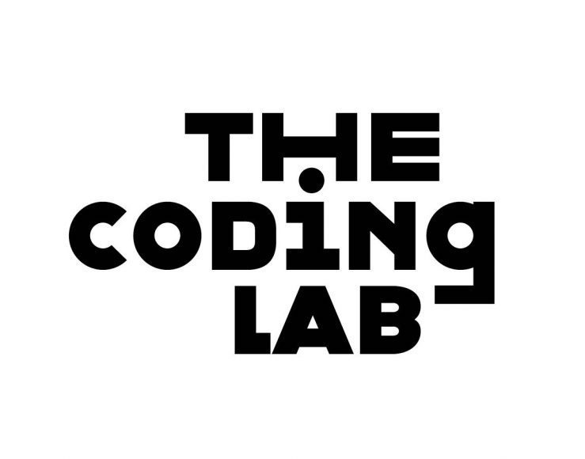

# Coding Lab Discord Bot

The Coding Lab Discord Bot is a bot that helps ITP/IMA students find information about the coding lab resources for virtual help on the Discord platform.



## About

The Coding Lab Discord bot is a bot that gives information about ITP/IMA's coding lab. It allows users on the ITP/IMA Discord server to query the Coding Lab's Google Sheet to provide up-to-date information about mentors, skills, timeslots, and how to get remote hours. 

## Usage
```
!codinglab - provides a list of coding lab mentors, their skills, hours, and contact info
!codinglab skill <any skill> - provides a list of mentors that know the requested skill
!codinglab help - provides help guide
```

## Setup

### Prerequisites

To run the discord bot you must have:
1. Node.js
2. Membership to the ITP Discord Server
3. Authentication files:
  1. auth.json
  2. credentials.json
  3. token.json
  4. `.env` for channel authentication

### Installation

1. Clone the repository with `git clone git@github.com:Emceelamb/codinglab-bot.git`
2. Change to the directory: `cd codinglab-bot`
3. Install necessary node packages with: `npm install`
4. Save the authentication files to the `codinglab-bot` directory
5. Run the bot with `npm start`

### Develop & Contribute

Please submit bugs and feature requests as github issues.  
Please e-mail the project owner to get the authentication files.  
Feel free to fork the project and submit a pull request

## Built with

* [VIM](https://www.vim.org/)
* [Github](https://github.com)

## Authors

* [Mark Lam](https://markofthelam.com) 
* [Vince Shao](https://www.vinceshao.com/) 
* [Billy Bennett](https://github.com/billythemusical)
